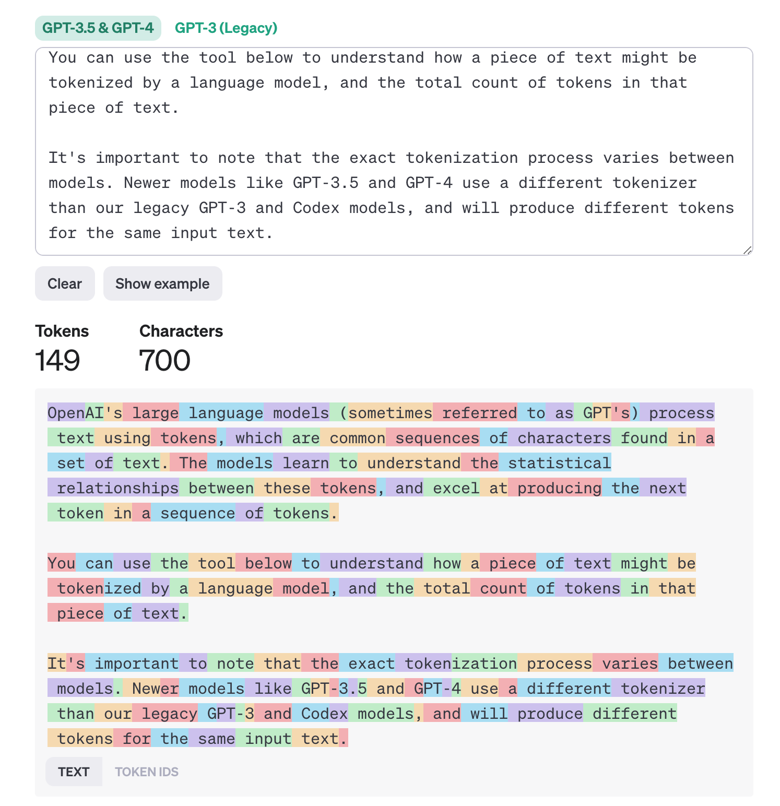
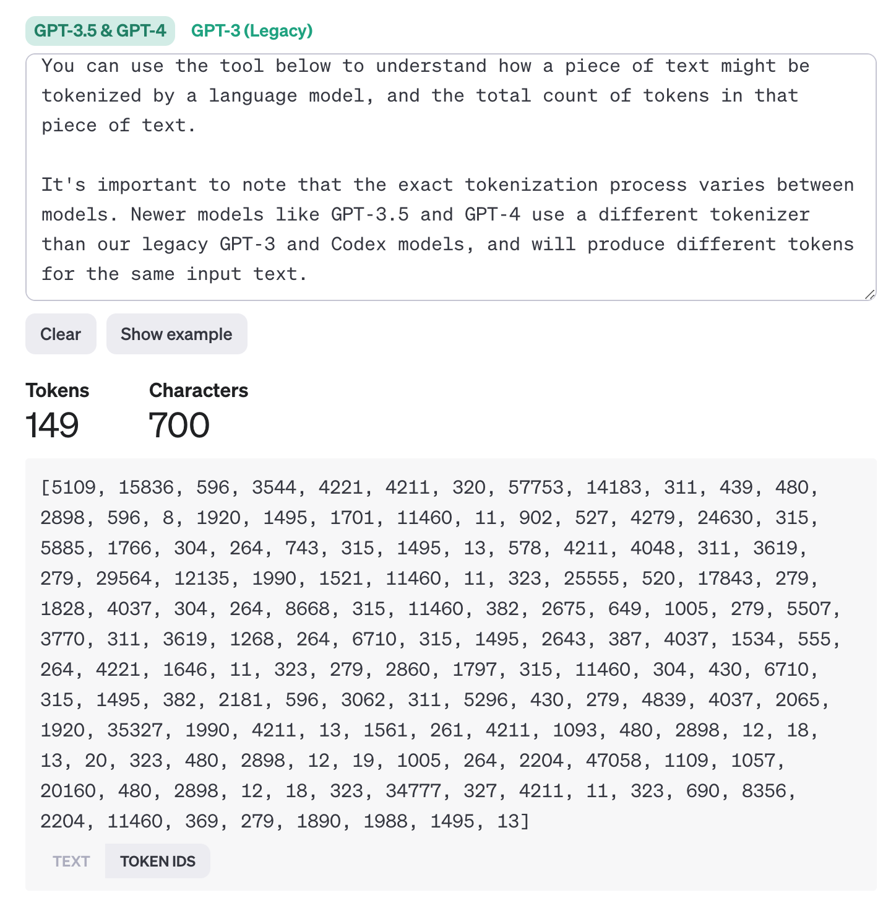

# 生成式AI原理浅析

## AI 发展阶段

#### 人工智能：1956

人工智能已经有几十年的历史，作为计算机科学一个领域，寻找创造可以取代或者超越人类智力的机器

#### 机器学习：1997

AI的子集

随着统计方法在文本分析中的应用，促进的一种新算法的发展，能让机器从已有数据中学习，改进并决策或预测。基于数学上的统计方法，允许机器模拟人类的语音理解，在文本标签配对方面训练统计模型，使该模型能够将未知输入文本分类，并使用预先定义的标签表示文本的意图。

#### 深度学习：2017

机器学习的子集

近年来，随着硬件发展，硬件能处理更大量更复杂的数据，促进了神经网络或深度学习算法的发展。基于神经网络（特别是RNNs循环神经网络）的机器学习技术，显著增加了自然语言处理能力

#### 生成式AI：2021

深度学习的子集

随着AI领域的发展，一个新模型架构被提出：Transformer。新模型克服了RNNs的限制，能处理更长的文本输入。基于注意力机制（attention mechanism），模型能对输入赋予不同的权重，能够关注最相关的信息，不论在文本中出现的顺序。

大部分生成式AI模型，被称作大语言模型（Large Language Models, LLMs），因为使用了文本输入和输出的结构。这些模型可以处理大量没有标记的数据进行训练，可以适应各种不同的任务，已创造性的方式来生成语法正确的文本。极大地增强了机器处理文本的能力，并且能够以人类语法生成原始响应

## 大语言模型如何工作

### 1. 文本输入token化

LLMs模型输入输出都是文本，实际上内部还是基于统计模型，模型内部使用数字处理比直接处理文本效率高。因此文本输入时，在被核心模型使用之前需要被tokenizer处理，经过标记处理后形成token（一个token是由多个不同字符组成的子串），输出token对应的标号数组（每一个token都有对应的数字编码）。

ChatGPT分词器：https://platform.openai.com/tokenizer?WT.mc_id=academic-105485-koreyst

分词结果：

token数组：

> 所以对于AI模型，并不是真正理解了文本，模型只是处理建立了不同文本间的关系

### 2. 预测输出

预测输出即内容生成过程

一次预测过程：模型在接收到输入的一系列token后，会预测一个token进行输出。预测输出过程基于概率分布。在预测过程中，模型根据当前输入的token数组，根据训练的文本数据，计算出下一个token可能出现的概率分布，依据概率选择输出token。此步骤依赖提前给模型训练的文本数据。

### 3. 处理预测输出

得到预测结果的token后，模块会已扩展窗口形式，把该token合并至输入的token，作为下一次预测的输入，不断重复这个过程。

> 因此可以解释在模型使用的过程中，回答不是一次性生成的，而是不间断返回，并且在句子生成过程中间会产生停顿。

* 模型内容生成过程像是一个单字接龙的过程
* 长文由短文自回归生成

## Auto-GPT介绍

> AutoGPT原名是EntreprenurGPT，Significant Gravitas在2023年3月16日表达了他想创造一个实验项目，看看GPT-4能否在人类商业世界中生存，简单来说就是是否可以挣钱。其核心思想就是不停的向GPT-4发送请求，让其做商业决策，最后根据这个决策执行，看GPT-4给的策略能挣多少钱。
>
> 根据Significant Gravitas的推文，自从那天之后他每天都在给EntreprenurGPT增加能力：包括拥有long term的记忆、生成子实例完成不同的任务、根据网址返回404的错误来重新使用Google检索，找到合适的网址等。

